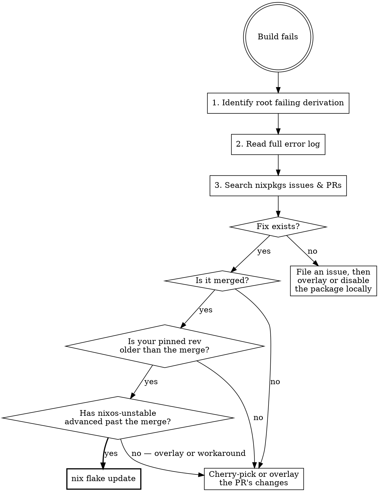

# NixOS Build Failure Triage

## Overview

When a nix build fails, check upstream for existing fixes before patching locally. Most nixpkgs build failures are already known and fixed — the fix just hasn't reached your pinned revision yet. Adding a local overlay when `nix flake update` would suffice creates unnecessary maintenance burden.

## When to Use

- `nix build` fails with a package derivation build error
- Build failures that cascade through dependencies
- Package build errors after a nixpkgs channel update
- Errors from autotools, meson, cmake, or other build systems

## When NOT to Use

- Configuration errors (NixOS option issues, module conflicts, type errors)
- Hash mismatches (`fetchurl`/`fetchFromGitHub` checksum errors — these need `updater` or manual hash fix)
- Local code changes causing failures
- Disk space or permission errors

## Flowchart



## Steps

### 1. Identify the Root Failing Derivation

Skip cascade failures. Find the **first** derivation that failed — the one whose error is not "dependency failed."

Look for lines like:
```
error: Cannot build '/nix/store/...-elinks-0.19.1.drv'.
       Reason: builder failed with exit code 1.
```

**NOT** lines like:
```
error: Cannot build '/nix/store/...-home-manager-files.drv'.
       Reason: 1 dependency failed.
```

### 2. Read the Full Error Log

```
nix log /nix/store/<hash>-<package>.drv
```

Extract the specific error message. This is your search keyword.

### 3. Search Upstream

Search nixpkgs issues and PRs with the error message or package name.

**If GitHub MCP tools are available** (preferred):
- `github_search_issues` with `owner: "NixOS"`, `repo: "nixpkgs"`, `query: "<error keyword>"`
- `github_search_pull_requests` with `owner: "NixOS"`, `repo: "nixpkgs"`, `query: "<package name>"`
- `github_pull_request_read` to check merge status and date

**Otherwise, fall back to `gh` CLI:**
```
gh search issues --repo NixOS/nixpkgs "<error keyword>"
gh search prs --repo NixOS/nixpkgs "<package name>"
```

Determine: Does a fix exist? Is it merged? When was it merged?

### 4. Compare Pinned Revision

Find your nixpkgs rev in `flake.lock`. Get its commit date and compare against the merge date of the fix.

**Then check whether nixos-unstable has advanced past the merge.** A fix merged into nixpkgs master may not yet be available in the nixos-unstable branch (which flakes following `nixos-unstable` track). This is a common source of confusion — `nix flake update` will NOT help if the channel hasn't advanced.

**If GitHub MCP tools are available** (preferred):
- `github_get_commit` with `owner: "NixOS"`, `repo: "nixpkgs"`, `sha: "<your-pinned-rev>"` — get your pinned rev's date
- `github_list_commits` with `owner: "NixOS"`, `repo: "nixpkgs"`, `sha: "nixos-unstable"`, `perPage: 1` — get the latest nixos-unstable commit and its date
- Compare the latest nixos-unstable commit date against the fix merge date
- `github_get_file_contents` with `owner: "NixOS"`, `repo: "nixpkgs"`, `path: "<package-path>"`, `ref: "<your-rev>"` — verify the fix is absent from your pin
- `github_pull_request_read` with `method: "get_files"` to compare against the PR diff

**Otherwise, fall back to `gh` CLI:**
```
gh api repos/NixOS/nixpkgs/commits/<your-rev> --jq '.commit.committer.date'
gh api repos/NixOS/nixpkgs/commits/nixos-unstable --jq '.[0].commit.committer.date'
gh api repos/NixOS/nixpkgs/contents/<package-path>?ref=<your-rev>
```

Determine the state:
- Fix is in your pinned rev → re-examine (something else is wrong)
- Fix is NOT in your pin, but IS in latest nixos-unstable → `nix flake update` will pull it
- Fix is NOT in your pin, and NOT yet in nixos-unstable → must overlay/workaround

### 5. Resolve

| Situation | Resolution |
|-----------|------------|
| Fix merged, already in your pinned rev | Re-examine — something else is wrong |
| Fix merged, not in your pin but in latest nixos-unstable | `nix flake update` — simplest path |
| Fix merged, but nixos-unstable hasn't advanced past the merge yet | Cherry-pick/overlay the PR's changes, or wait/workaround |
| Fix exists but not merged | Cherry-pick or overlay the PR's changes |
| No fix exists | File an issue, then overlay or disable the package locally |

**Prefer `nix flake update` over local overlays.** But only when the fix is actually available in the nixos-unstable channel. Overlays add maintenance burden and can conflict with future nixpkgs updates.

## Quick Reference

| Step | GitHub MCP (preferred) | CLI fallback |
|------|----------------------|-------------|
| Build | — | `nix build .#nixosConfigurations.<host>.config.system.build.toplevel` |
| Read log | — | `nix log /nix/store/<drv>` |
| Search issues | `github_search_issues(owner="NixOS", repo="nixpkgs", query="...")` | `gh search issues --repo NixOS/nixpkgs "<error>"` |
| Search PRs | `github_search_pull_requests(owner="NixOS", repo="nixpkgs", query="...")` | `gh search prs --repo NixOS/nixpkgs "<package>"` |
| Check PR merge | `github_pull_request_read(method="get", ...)` | `gh pr view <num> --json mergedAt` |
| Check pinned rev date | `github_get_commit(owner="NixOS", repo="nixpkgs", sha="<rev>")` | `gh api repos/NixOS/nixpkgs/commits/<rev> --jq '.commit.committer.date'` |
| Check latest nixos-unstable | `github_list_commits(owner="NixOS", repo="nixpkgs", sha="nixos-unstable", perPage=1)` | `gh api repos/NixOS/nixpkgs/commits/nixos-unstable --jq '.[0].commit.committer.date'` |
| Check package at rev | `github_get_file_contents(ref="<rev>", path="...", ...)` | `gh api repos/NixOS/nixpkgs/contents/<path>?ref=<rev>` |
| Check pinned rev | Read `flake.lock` | Read `flake.lock` |
| Update flake | — | `nix flake update` |

## Common Mistakes

| Mistake | Why It's Wrong |
|---------|---------------|
| Adding a local overlay before checking upstream | Creates maintenance burden when `nix flake update` would fix it |
| Fixing cascade deps instead of root cause | The same root failure will break other dependents too |
| Assuming nixpkgs is up to date | `flake.lock` may pin a rev from weeks ago |
| Assuming `nix flake update` will pull the fix | The nixos-unstable branch may lag behind master; the fix may be merged but not yet in the channel |
| Running `nix flake update` blindly without checking | Could pull unrelated breakages; better to confirm the fix exists and is in the channel first |
| Filing duplicate issues | Always search before filing |
